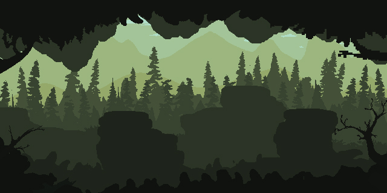

# Treasure in the Caves

A 2D adventure game where you navigate through dangerous caves filled with zombies to collect treasure. Built with Python and Pygame.

## Features

- Multiple challenging levels with increasing difficulty
- Animated zombie enemies with horizontal/vertical movement patterns
- Treasure collection mechanic with fake treasures as decoys
- Deadly traps and obstacles
- Win/lose conditions with visual feedback
- Clean sprite-based graphics

## Gameplay

- Use **WASD** keys to move your character
- Avoid contact with zombies and traps
- Navigate through maze-like cave walls
- Find and collect the main treasure to advance
- Watch out for fake treasures!

## Technical Details

- Object-oriented design with sprite classes
- Collision detection system
- State machine for game flow (menu, gameplay, win/lose screens)
- Level system with easy expansion

## Requirements

- Python 3.x
- Pygame library

## Installation

# Happy treasure hunting! ⚔️💎